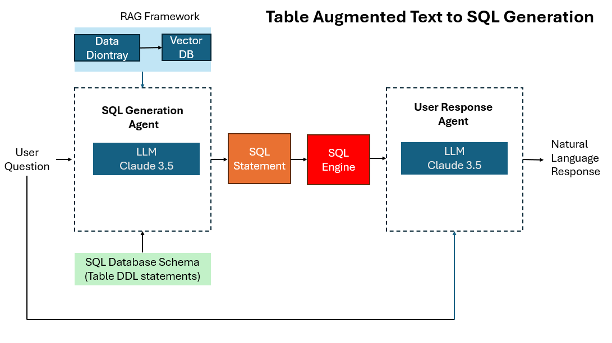

# Table Augmented Text-to-SQL (TAG Text2SQL)

This project enables non-technical users to ask questions about a database in natural language and receive meaningful, human-readable answers without having to write SQL. It uses a large language model (LLM) to generate SQL queries, executes them, and formulates concise natural-language responses.

## Key Features
- Streamlit-based chat interface with an optional SQL display toggle.
- SQL generation powered by Anthropic Claude 3.5 via Amazon Bedrock.
- Table-Augmented Generation (TAG) combining schema awareness and a retrieval-augmented generation (RAG) framework.
- Real-time SQL execution with summarized, user-friendly results.
- Out-of-the-box support for SQLite, with optional fields for connecting to other SQL databases.

## System Architecture



The application follows a modular architecture that includes three main components: **SQL Generation Agent**, **SQL Engine**, and **User Response Agent**. These are supported by the **RAG Framework** and the **Schema Engine**.

### 1. SQL Generation Agent
When a user submits a question, the SQL Generation Agent uses the Claude 3.5 LLM to translate the natural-language question into a SQL statement. It does this by leveraging two key inputs:
- **Database Schema (DDL)**: Provides table and column definitions, ensuring the generated SQL references the correct structures.
- **RAG Context**: Retrieves column-level metadata and descriptions from a data dictionary (stored in a PDF). This allows the model to map natural-language terminology to database-specific field names more accurately.

### 2. SQL Engine
The generated SQL is executed against the connected database (SQLite by default, or MySQL, PostgreSQL, Redshift, etc. when configured). Results are returned as structured data.

### 3. User Response Agent
The SQL results and user question are passed to a second Claude 3.5 model instance that formulates a concise natural-language response. This ensures the user receives readable, contextually accurate insights derived from the SQL output.

## When Schema and RAG Are Used
- **Schema Loading**: At initialization or upon connecting to a new database, the schema is fetched via `db.get_table_info()`. It provides the table and column structure that informs SQL generation.
- **RAG Invocation**: On every user query, the system performs a similarity search within a FAISS vector store built from `data_dict.pdf`. This RAG context helps disambiguate questions, such as interpreting “loan amount” vs. “principal balance,” based on column descriptions.
- Both components work together—Schema ensures syntactic validity, while RAG ensures semantic alignment with business terms.

## Requirements
- Python 3.10+
- AWS account with Bedrock access (Claude 3.5 Sonnet) in `us-east-1`
- SQLite database file (default: `snyth.db`)
- Data dictionary file `data_dict.pdf` for RAG indexing

### Python Packages
```
streamlit
langchain-core
langchain-community
boto3
botocore
PyPDF2
sentence_transformers
faiss-cpu
```

## Installation and Quickstart

```bash
# 1. Create and activate a virtual environment
python -m venv .venv
source .venv/bin/activate   # Windows: .venv\Scripts\activate

# 2. Install dependencies
pip install -r requirements.txt

# 3. Place snyth.db and data_dict.pdf in the project root

# 4. Run the Streamlit app
streamlit run TAG_Text2SQL.py
```

Then open the provided local URL (e.g., http://localhost:8501).

## Configuration

### Database Connection
- Default: local SQLite file (`snyth.db`).
- To connect to other databases, use the sidebar to input:
  - Host, Port, User, Password, Database  
  The system will construct a connection URI compatible with LangChain’s `SQLDatabase` class.

### AWS / Bedrock Configuration
- Region: `us-east-1`
- Model: `anthropic.claude-3-5-sonnet-20240620-v1:0`
- Ensure valid AWS credentials are available via environment variables, IAM role, or credentials file.

### RAG Data
`data_dict.pdf` is split into text chunks and embedded using `sentence-transformers/all-MiniLM-L6-v2`. The resulting FAISS index is queried on each user question to enhance the model’s contextual understanding.

## Using the App
1. Enter a natural-language question in the chat interface.
2. Optionally toggle “Display SQL” to view the generated SQL.
3. The model will execute the SQL and return a concise natural-language summary of the results.

## Project Structure
```
.
├── TAG_Text2SQL.py        # Main Streamlit app (LLM + SQL + RAG pipeline)
├── snyth.db               # Example SQLite database
├── data_dict.pdf          # Data dictionary used for RAG
├── system_diagram.png     # System architecture diagram
├── requirements.txt       # Python dependencies
└── README.md              # Documentation
```

## Prompt Summaries

**SQL Prompt**  
“Based on the table schema and context below, write a SQL query that would answer the user's question. Only return the SQL code.”  
Variables: `{schema}`, `{context}`, `{history}`, `{question}`

**Response Prompt**  
“Based on the table schema below, question, SQL query, and SQL response, write a natural-language answer. Keep it concise (1–2 sentences) and include numeric details or lists as needed.”

## Development Notes
- Ensure your data dictionary accurately represents your database for the best RAG performance.
- The “Display SQL” option is useful for debugging query generation.
- You can easily extend this system to support other databases using SQLAlchemy-compatible URIs.

## Future Enhancements
- Add authentication and role-based access control
- Implement schema caching and vector persistence
- Create automated evaluation scripts for prompt accuracy
- Add Dockerfile and CI pipeline for deployment

## License
MIT License (or replace with your organization’s preferred license)
